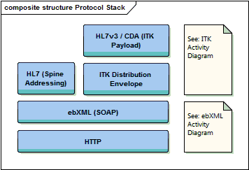
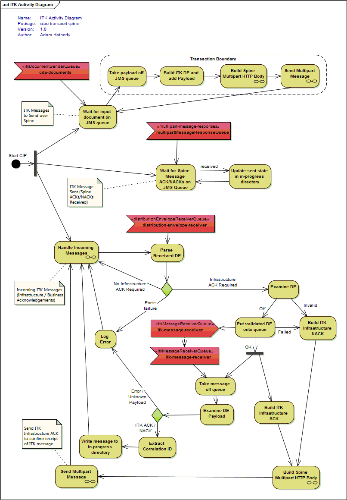
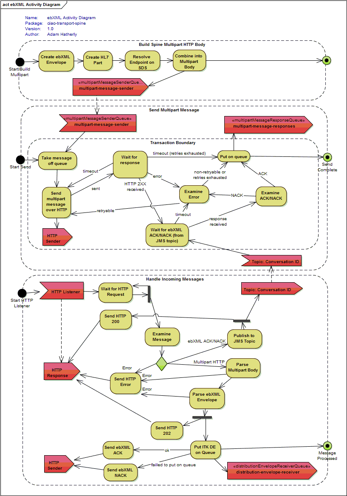

# ciao-transport-spine
CIP to transport messages over Spine

How it Works
============

In order to understand how this CIP sends documents over the Spine, we first need to understand the different protocols in use:

If we were to consider the full set of activities to send a document over the Spine using the below protocols, the process would appear quite complex. By splitting the activities into the two main layers (ITK and ebXML), the processing required is much easier to understand.

The ITK layer includes the basic sending, coupled with a simple acknowledgement framework which allows the sender to request an Infrastructrue Acknowledgement (to confirm the ITK message has reached it's destination), and a Business Acknowledgement (to confirm "business receipt" - the exact meaning of which is specific to the type of document being sent).

The below activity diagram shows the high level activities involved in processing the overall message and ITK-layer interactions:

Some of the individual boxes on the ITK diagram above represent the lower level ebXML interactions - these lower level protocol activities are shown in the below ebXML activity diagram.

The ebXML layer deals with sending these higher level ITK interactions over the Spine. It uses a multipart HTTP message as defined in the ebXML specification, and each individual ebXML message is Asynchronously acknowledged with a corresponding ebXML Acknowledgement (or error).

