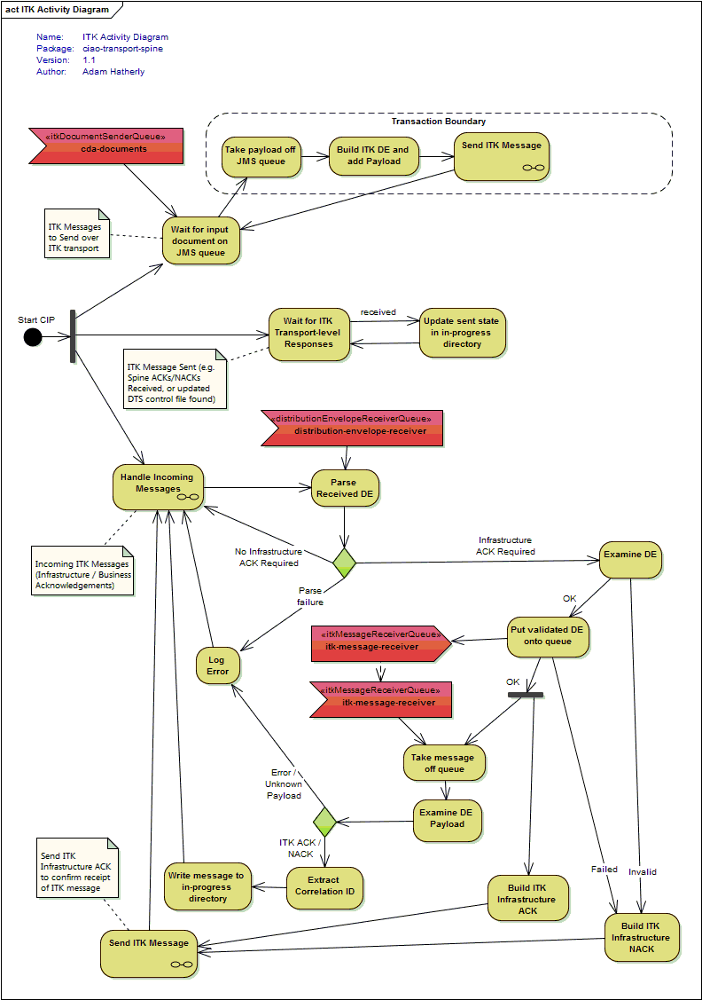

# ciao-transport-dts

*CIP to transport ITK messages over DTS*

## Introduction

As outlined in the main project [README](../README.md), transferring documents using the [Interoperability Toolkit(ITK)](http://systems.hscic.gov.uk/interop/itk) specifications results in a layered system of:
- **Business Message Layer** - e.g. [CDA documents](https://github.com/nhs-ciao/ciao-cda-builder/)
- **ITK Layer** - `Distribution Envelope` and `Acknowledgement Framework`
- **Transport Layer** - e.g. [Spine](http://systems.hscic.gov.uk/spine) or [DTS/MESH](http://systems.hscic.gov.uk/spine/DTS)

This CIP includes the `ITK Layer` (by importing [ciao-transport-itk](../ciao-transport-itk)) and the `Transport Layer` by providing DTS/MESH-specific functionality.

## How it Works

In order to understand how this CIP sends documents over DTS, we first need to understand the different protocols in use:

**TODO: add diagram with DTS components in the bottom layer**


If we were to consider the full set of activities to send a document over DTS using the below protocols, the process would appear quite complex. By splitting the activities into the two main layers (ITK and DTS), the processing required is much easier to understand.

The ITK layer includes the basic sending, coupled with a simple acknowledgement framework which allows the sender to request an Infrastructure Acknowledgement (to confirm the ITK message has reached it's destination), and a Business Acknowledgement (to confirm "business receipt" - the exact meaning of which is specific to the type of document being sent).

The below activity diagram shows the high level activities involved in processing the overall message and ITK-layer interactions:



Some of the individual boxes on the ITK diagram above represent the lower level DTS interactions - these lower level protocol activities are shown in the below DTS activity diagram.

The DTS layer deals with sending these higher level ITK interactions over DTS/MESH. Messages are sent/received by writing/reading pairs of files on the filesystem. A DTS/MESH client process is responsible for handling the interactions with the central server.

- The control file (*.ctl) specifies details such as sender address, receiver address, and correlation id.
- The corresponding data file (*.dat) contains the payload message (in any format).

**TODO: add DTS specific activity diagram**


## Configuration

For further details of how ciao-configuration and Spring XML interact, please see [ciao-core](https://github.com/nhs-ciao/ciao-core).

### Spring XML

On application start-up, a series of Spring Framework XML files are used to construct the core application objects. The created objects include the main Camel context, input/output components, routes and any intermediate processors.

The configuration is split into multiple XML files, each covering a separate area of the application. These files are selectively included at runtime via CIAO properties, allowing alternative technologies and/or implementations to be chosen. Each imported XML file can support a different set of CIAO properties.

The Spring XML files are loaded from the classpath under the [META-INF/spring](src/main/resources/META-INF/spring) package.

**Core:**

-   `beans.xml` - The main configuration responsible for initialising properties, importing additional resources and starting Camel.

**Repositories:**

> An `IdempotentRepository' is configured to enable [multiple consumers](http://camel.apache.org competing-consumers.html) access the same folder concurrently.

- 'repository/memory.xml' - An in-memory implementation suitable for use when there is only a single consumer, or multiple-consumers are all contained within the same JVM instance.
- 'repository/hazelcast.xml' - A grid-based implementation backed by [Hazelcast](http://camel.apache.org/hazelcast-component.html). The component is hosted entirely within the JVM process and uses a combination of multicast and point-to-point networking to maintain a cross-server data grid.

**Processors:**

-   `processors/default.xml` - *Currently a NOOP*

**Messaging:**

-   `messaging/activemq.xml` - Configures ActiveMQ as the JMS implementation for input/output queues.
-   `messaging/activemq-embedded.xml` - Configures an internal embedded ActiveMQ as the JMS implementation for input/output queues. *(For use during development/testing)*

**Addressing:**

-	`addressing/static.xml` - Configures the CIP to resolve ITK to DTS addresses using the static values defined via the `staticJson.resourcePaths` property.

### CIAO Properties

At runtime ciao-transport-dts uses the available CIAO properties to determine which Spring XML files to load, which Camel routes to create, and how individual routes and components should be wired.

**Camel Logging:**

-	`camel.log.mdc` - Enables/disables [Mapped Diagnostic Context](http://camel.apache.org/mdc-logging.html) in Camel. If enabled, additional Camel context properties will be made available to Log4J and Logstash. 
-	`camel.log.trace` - Enables/disables the [Tracer](http://camel.apache.org/tracer.html) interceptor for Camel routes.
-	`camel.log.debugStreams` - Enables/disables [debug logging of streaming messages](http://camel.apache.org/how-do-i-enable-streams-when-debug-logging-messages-in-camel.html) in Camel.

**Spring Configuration:**

-   `repositoryConfig` - Selects which repository configuration to load:
	`repositories/${repositoryConfig}.xml`
-   `processorConfig` - Selects which processor configuration to load:
	`processors/${processorConfig}.xml`
-   `messagingConfig` - Selects which messaging configuration to load:
	`messaging/${messagingConfig}.xml`
-   `addressingConfig` - Selects which addressing configuration to load:
	`addressing/${addressingConfig}.xml`

**DTS Configuration:**
- `dts.rootFolder` - The root folder of the DTS file structure
- `dts.temporaryFolder` - Temporary folder used to initially write files into before moving them into the `${dts.rootFolder}/OUT` folder.
- `dts.filePrefix` - An optional filename prefix added to all outgoing files in the `${dts.rootFolder}/OUT` folder. This can be used to distinguish which application added the file and to filter the corresponding sent notifications from the `${dts.rootFolder}/SENT` folder. This property is useful in deployments where multiple applications share the same DTS mailbox.
- `dts.errorFolder` - Folder where incoming control/data file pairs are moved to if an error occurs during processing. If this property is left blank, the files are deleted instead. This applies to reading the `${dts.rootFolder}/IN` and `${dts.rootFolder}/SENT` folders.
- `dts.completedFolder` - Folder where incoming control/data file pairs are moved to if an error occurs during processing. If this property is left blank, the files are deleted instead. This applies to reading the `${dts.rootFolder}/IN` and `${dts.rootFolder}/SENT` folders.

> If relative file-paths are specified, they are resolved relative to the relevant sub-folder under `dts.rootFolder`. For example, to register a file for sending it needs to be stored in `${dts.rootFolder}/OUT` but the file is first written into `dts.temporaryFolder` then moved to the final destination. In this case `dts.temporaryFolder` is resolved relative to `${dts.rootFolder}/IN`.

**Distribution Envelope Configuration:**
- `senderItkService` - The ITK service added to outgoing distribution envelopes
- `senderODSCode` - The sender ODS code added to outgoing distribution envelopes
- `auditODSCode` - The audit ODS code added to outgoing distribution envelopes (if this property is not defined, `senderODSCode` is used).

**Control File Configuration:**
- `dts.workflowId` - Workflow ID added to outgoing control files (may be overridden for *response* messages where the original workflow id is echoed back)
- `dts.senderMailbox` - Send DTS mailbox (From_DTS) added to outgoing control files
- `dts.receiverWorkflowIds` - Comma separated list of workflow IDs which will be accepted and handled on incoming messages

> *If incoming control files do not match the a valid combination of `dts.senderMailbox` and `dts.receiverWorkflowIds`, the control file is not processed and is left in the directory. The DTS directory may be shared with other applications, and incoming messages may be intended for them.*

**Queue Configuration:**
- `itkDocumentSenderQueue` - JMS queue for processing outgoing ITK documents
- `distributionEnvelopeReceiverQueue` - JMS queue for processing incoming ITK Distribution Envelopes
- `itkMessageReceiverQueue` - JMS queue for processing incoming ITK messages

**Address Resolution Configuration:**
- `addressing.staticFiles` - A comma-separated list of static files which provide static JSON-encoded [DTSEndpointAddress](src/main/java/uk/nhs/ciao/transport/dts/address/DTSEndpointAddress.java) values.

> Configuration of the cache (e.g. time to live, cache size) is specified in the `repositories\hazelcast.xml` spring file. 

**In-progress Folder:**
> Details of the in-progress folder structure are available in the `ciao-docs-finalizer` [state machine](https://github.com/nhs-ciao/ciao-docs-finalizer/blob/master/docs/state-machine.md) documentation.

> `ciao-docs-parser` provides the [InProgressFolderManagerRoute](https://github.com/nhs-ciao/ciao-docs-parser/blob/master/ciao-docs-parser-model/src/main/java/uk/nhs/ciao/docs/parser/route/InProgressFolderManagerRoute.java) class to support storing control and event files in the in-progress directory.

- `inProgressFolder` - Defines the root folder that *document upload process* events are written to.

### Example
```INI
# Camel logging
camel.log.mdc=true
camel.log.trace=false
camel.log.debugStreams=false

# Select which processor config to use (via dynamic spring imports)
processorConfig=default

# Select which messaging config to use (via dynamic spring imports)
messagingConfig=activemq
#messagingConfig=activemq-embedded

# Select which idempotent repository config to use (via dynamic spring imports)
repositoryConfig=hazelcast
# repositoryConfig=memory

# Select which addressing config to use (via dynamic spring imports)
addressingConfig=static

# ActiveMQ settings (if messagingConfig=activemq)
activemq.brokerURL=tcp://localhost:61616
activemq.userName=smx
activemq.password=smx

# Common JMS/ActiveMQ settings (if messagingConfig=activemq or activemq-embedded)
jms.concurrentConsumers=20

# Hazelcast settings (if repositoryConfig=hazelcast)
hazelcast.group.name=ciao-transport-dts
hazelcast.group.password=ciao-transport-dts-pass
hazelcast.network.port=5701
hazelcast.network.join.multicast.group=224.2.2.3
hazelcast.network.join.multicast.port=54327

# Common addressing settings (if addressingConfig=static)
addressing.staticFiles=

senderODSCode=!REQUIRED!
# auditODSCode=optional - defaults to senderODSCode

senderItkService=urn:nhs-itk:services:201005:sendDistEnvelope

itkDocumentSenderQueue=cda-documents
distributionEnvelopeReceiverQueue=distribution-envelope-receiver
itkMessageReceiverQueue=itk-message-receiver

inProgressFolder=./in-progress

# DTS settings
dts.rootFolder=./dts
dts.temporaryFolder=../dts-temp
dts.filePrefix=!REQUIRED! ${siteid}${APP}
dts.workflowId=TOC_DISCH_DMS
dts.senderMailbox=!REQUIRED!
dts.receiverWorkflowIds=TOC_DISCH_DMS_ACK

# DTS housekeeping options - if the property is empty the file is deleted
dts.errorFolder=./dts-error
dts.completedFolder=
```

## Building and Running

To pull down the code, run:

	git clone https://github.com/nhs-ciao/ciao-transport-itk.git
	
You can then compile the module via:

    cd ciao-transport-itk-parent
	mvn clean install -P bin-archive

This will compile a number of related modules - the main CIP module for Spine is `ciao-transport-dts`, and the full binary archive (with dependencies) can be found at `ciao-transport-spine\target\ciao-transport-dts-{version}-bin.zip`. To run the CIP, unpack this zip to a directory of your choosing and follow the instructions in the README.txt.

The CIP requires access to various file system directories and network ports (dependent on the selected configuration):

**etcd**:
 -  Connects to: `localhost:2379`

**ActiveMQ**:
 -  Connects to: `localhost:61616`

**Hazelcast**:
 -  Multicast discovery: `224.2.2.3:54327`
 -  Listens on: `*:5701` (If port is already taken, the port number is incremented until a free port is found)

**DTS**:
 -  Files are read from / written to the main DTS folder structure defined by the `dts.rootFolder`.
 -  Additional directories (relative to the main DTS folder) defined by the `dts.temporaryFolder`, `dts.errorFolder`, and `dts.completedFolder` properties will also be used.

**Filesystem**:
 -  If etcd is not available, CIAO properties will be loaded from: `~/.ciao/`
 -  For key events in the document upload lifecycle, the CIP will write an event to the folder specified by the `inProgressFolder` property.
 -  If static addresses are enabled, the files specified by the `addressing.staticFiles` property will be read from the file system. Relative paths are resolved relative to CIP working directory.

## Models

The Control File message type is used when sending messages over DTS. The [ciao-dts](https://github.com/nhs-ciao/ciao-utils/tree/master/ciao-dts) library provides a Java representation of this types, along with serialization to/from XML, and integration with Apache Camel's [type conversion system](http://camel.apache.org/type-converter.html).

### Control File

Control files are used both when sending/receiving data messages over DTS/MESH, and when receiving reports. DTS control files are encoded using an XML format.

**Java Classes:**
-	`ControlFile` - provides a bean-like representation of a DTS control file.
-	`ControlFileParser` - parses an XML serialized control file to object form.
-	`ControlFileSerializer` - serializes a control file object into XML.
-	`ControlFileTypeConverter` - Integrates the control file parser and serializer with Camel.
