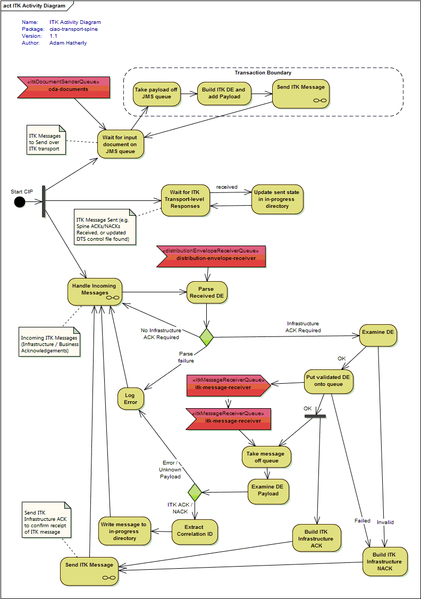
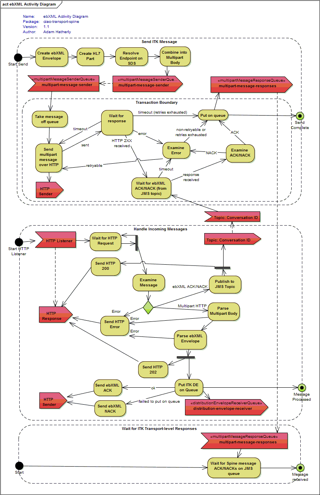

# ciao-transport-spine

*CIP to transport messages over Spine*

## Introduction

As outlined in the main project [README](../README.md), transferring documents using the [Interoperability Toolkit(ITK)](http://systems.hscic.gov.uk/interop/itk) specifications results in a layered system of:
- **Business Message Layer** - e.g. [CDA documents](https://github.com/nhs-ciao/ciao-cda-builder/)
- **ITK Layer** - `Distribution Envelope` and `Acknowledgement Framework`
- **Transport Layer** - e.g. [Spine](http://systems.hscic.gov.uk/spine) or [DTS/MESH](http://systems.hscic.gov.uk/spine/DTS)

This CIP includes the `ITK Layer` (by importing [ciao-transport-itk](../ciao-transport-itk)) and the `Transport Layer` by providing Spine-specific functionality.

## How it Works

In order to understand how this CIP sends documents over the Spine, we first need to understand the different protocols in use:


If we were to consider the full set of activities to send a document over the Spine using the below protocols, the process would appear quite complex. By splitting the activities into the two main layers (ITK and ebXML), the processing required is much easier to understand.

The ITK layer includes the basic sending, coupled with a simple acknowledgement framework which allows the sender to request an Infrastructure Acknowledgement (to confirm the ITK message has reached it's destination), and a Business Acknowledgement (to confirm "business receipt" - the exact meaning of which is specific to the type of document being sent).

The below activity diagram shows the high level activities involved in processing the overall message and ITK-layer interactions:



Some of the individual boxes on the ITK diagram above represent the lower level ebXML interactions - these lower level protocol activities are shown in the below ebXML activity diagram.

The ebXML layer deals with sending these higher level ITK interactions over the Spine. It uses a multipart HTTP message as defined in the ebXML specification, and each individual ebXML message is Asynchronously acknowledged with a corresponding ebXML Acknowledgement (or error).



## Configuration

For further details of how ciao-configuration and Spring XML interact, please see [ciao-core](https://github.com/nhs-ciao/ciao-core).

### Spring XML

On application start-up, a series of Spring Framework XML files are used to construct the core application objects. The created objects include the main Camel context, input/output components, routes and any intermediate processors.

The configuration is split into multiple XML files, each covering a separate area of the application. These files are selectively included at runtime via CIAO properties, allowing alternative technologies and/or implementations to be chosen. Each imported XML file can support a different set of CIAO properties.

The Spring XML files are loaded from the classpath under the [META-INF/spring](src/main/resources/META-INF/spring) package.

**Core:**

-   `beans.xml` - The main configuration responsible for initialising properties, importing additional resources and starting Camel.

**Repositories:**

> An `IdempotentRepository' is configured to enable [multiple consumers](http://camel.apache.org competing-consumers.html) access the same folder concurrently.

- 'repository/memory.xml' - An in-memory implementation suitable for use when there is only a single consumer, or multiple-consumers are all contained within the same JVM instance.
- 'repository/hazelcast.xml' - A grid-based implementation backed by [Hazelcast](http://camel.apache.org/hazelcast-component.html). The component is hosted entirely within the JVM process and uses a combination of multicast and point-to-point networking to maintain a cross-server data grid.

**Processors:**

-   `processors/default.xml` - *Currently a NOOP*

**Messaging:**

-   `messaging/activemq.xml` - Configures ActiveMQ as the JMS implementation for input/output queues.
-   `messaging/activemq-embedded.xml` - Configures an internal embedded ActiveMQ as the JMS implementation for input/output queues. *(For use during development/testing)*

**Addressing:**

-	`addressing/static.xml` - Configures the CIP to resolve ITK to Spine addresses using the static values defined via the `staticJson.resourcePaths` property.
-	`addressing/sds.xml` - Configures the CIP to resolve ITK to Spine addresses using the Spine Directory Service(SDS). Additionally address caching (via Hazelcast) is enabled, and static values can also be supplied via the `staticJson.resourcePaths` property.

**Spine SSL:**
-	`ssl/vanilla.xml` - Configures the CIP to use standard non-TLS sockets for connecting to Spine.
-	`ssl/tls.xml` - Configures the CIP to use TLS-enabled sockets for connecting to Spine. This configuration requires a key store and a trust store to be specified via the `KEY_STORE` and `TRUST_STORE` properties.

### CIAO Properties

At runtime ciao-transport-spine uses the available CIAO properties to determine which Spring XML files to load, which Camel routes to create, and how individual routes and components should be wired.

**Camel Logging:**

-	`camel.log.mdc` - Enables/disables [Mapped Diagnostic Context](http://camel.apache.org/mdc-logging.html) in Camel. If enabled, additional Camel context properties will be made available to Log4J and Logstash. 
-	`camel.log.trace` - Enables/disables the [Tracer](http://camel.apache.org/tracer.html) interceptor for Camel routes.
-	`camel.log.debugStreams` - Enables/disables [debug logging of streaming messages](http://camel.apache.org/how-do-i-enable-streams-when-debug-logging-messages-in-camel.html) in Camel.

**Spring Configuration:**

-   `repositoryConfig` - Selects which repository configuration to load:
	`repositories/${repositoryConfig}.xml`
-   `processorConfig` - Selects which processor configuration to load:
	`processors/${processorConfig}.xml`
-   `messagingConfig` - Selects which messaging configuration to load:
	`messaging/${messagingConfig}.xml`
-   `addressingConfig` - Selects which addressing configuration to load:
	`addressing/${addressingConfig}.xml`
-   `sslConfig` - Selects which SSL configuration to load:
	`ssl/${sslConfig}.xml`

**Spine Configuration:**
- `spine.toUri` - URI for sending outgoing messages to Spine.
- `spine.fromUri` - URI of HTTP/HTTPS server for receiving incoming messages from Spine.
- `spine.replyUri` - URI of JMS topic for processing asynchronous Spine ebXml acknowledgements.
- `sds.url` - URI of the SDS LDAP server.
- `sds.authentication` - Type of LDAP authentication used when connecting to SDS.
- `sds.principal` - LDAP principal / user used when connecting to SDS.
- `sds.credentials` - LDAP credentials / password used when connecting to SDS.

> Spine and SDS connection URIs depend on the selected SSL configuration. If TLS is enabled, then the URIs should include the `https`scheme, otherwise `http` should be used.

**Distribution Envelope Configuration:**
- `senderItkService` - The ITK service added to outgoing distribution envelopes
- `senderODSCode` - The sender ODS code added to outgoing distribution envelopes
- `auditODSCode` - The audit ODS code added to outgoing distribution envelopes (if this property is not defined, `senderODSCode` is used).

**EbXml/HL7 Configuration:**
- `senderService` - The ebXml service added to outgoing ebXml messages and SOAPAction headers
- `senderAction` - The ebXml action added to outgoing ebXml messages and SOAPAction headers
- `senderPartyId` - The sender PartyId added to outgoing ebXml messages
- `senderAsid` - The sender ASID added to outgoing HL7 messages

**Queue Configuration:**
- `itkDocumentSenderQueue` - JMS queue for processing outgoing ITK documents
- `multipartMessageSenderQueue` - JMS queue for processing outgoing Spine multipart messages
- `multipartMessageResponseQueue` - JMS queue for processing incoming Spine multipart messages
- `distributionEnvelopeReceiverQueue` - JMS queue for processing incoming ITK Distribution Envelopes
- `itkMessageReceiverQueue` - JMS queue for processing incoming ITK messages

> *The main input queue (`itkDocumentSenderQueue`) uses the JSON-encoded representation of [ParsedDocument](https://github.com/nhs-ciao/ciao-docs-parser/blob/master/docs/parsed-document.md). The `originalDocument` property contains the document to send, while the `properties` section contains additional details such as the recipient ODS code.*

**Address Resolution Configuration:**
- `addressing.staticFiles` - A comma-separated list of static files which provide static JSON-encoded [SpineEndpointAddress](src/main/java/uk/nhs/ciao/transport/spine/address/SpineEndpointAddress.java) values.
- `addressing.sdsCacheUri` - Defines the Hazelcast distributed map used to cache resolved endpoint addresses.

> Configuration of the cache (e.g. time to live, cache size) is specified in the `repositories\hazelcast.xml` spring file. 

**In-progress Folder:**
> Details of the in-progress folder structure are available in the `ciao-docs-finalizer` [state machine](https://github.com/nhs-ciao/ciao-docs-finalizer/blob/master/docs/state-machine.md) documentation.

> `ciao-docs-parser` provides the [InProgressFolderManagerRoute](https://github.com/nhs-ciao/ciao-docs-parser/blob/master/ciao-docs-parser-model/src/main/java/uk/nhs/ciao/docs/parser/route/InProgressFolderManagerRoute.java) class to support storing control and event files in the in-progress directory.

- `inProgressFolder` - Defines the root folder that *document upload process* events are written to.

**Hazelcast Configuration:**

The following properties are applicable for `repositoryConfig=hazelcast`:

- `hazelcast.group.name` - Name of the hazelcast cluster group
- `hazelcast.group.password` - Password of the hazelcast cluster group
- `hazelcast.network.port` - The network port to use for the hazelcast server - if the port is already in use it will be incremented until a free port is found
- `hazelcast.network.join.tcp_ip` - Comma separated list of static cluster members - if empty, multicast join should be enabled
- `hazelcast.network.join.multicast.enabled` - Boolean value specifying whether multicast join should be used to find cluster members - if false, static TCP-IP members should be specified
- `hazelcast.network.join.multicast.group` - Multicast address to use for finding cluster members
- `hazelcast.network.join.multicast.port` - Multicast port to use for finding cluster members

### Example
```INI
# Camel logging
camel.log.mdc=true
camel.log.trace=false
camel.log.debugStreams=false

# Select which processor config to use (via dynamic spring imports)
processorConfig=default

# Select which idempotent repository config to use (via dynamic spring imports)
repositoryConfig=hazelcast
# repositoryConfig=memory

# Select which messaging config to use (via dynamic spring imports)
messagingConfig=activemq
#messagingConfig=activemq-embedded

# Select which addressing config to use (via dynamic spring imports)
addressingConfig=static
#addressingConfig=sds

# Select which ssl config to use (via dynamic spring imports)
sslConfig=vanilla

# ActiveMQ settings (if messagingConfig=activemq)
activemq.brokerURL=tcp://localhost:61616
activemq.userName=smx
activemq.password=smx

spine.toUri=http://localhost:8123/
spine.fromUri=jetty:http://localhost:8122/
spine.replyUri=jms2:topic:document-ebxml-acks

# Spine SSL settings
TRUST_STORE=/opt/keystores/SpineDEVCerts.keystore
TRUST_STORE_PW=password
KEY_STORE=/opt/keystores/SpineCiaoTest1.keystore
KEY_STORE_PW=password
KEY_PASSWORD=password

# Spine SDS settings
sds.url=ldap://localhost:1234
sds.authentication=simple
sds.principal=cn=Manager,dc=example,dc=com
sds.credentials=passw0rd

# Common JMS/ActiveMQ settings (if messagingConfig=activemq or activemq-embedded)
jms.concurrentConsumers=20
jms2.concurrentConsumers=2

# Hazelcast settings (if repositoryConfig=hazelcast)
hazelcast.group.name=ciao-transport-spine
hazelcast.group.password=ciao-transport-spine-pass
hazelcast.network.port=5701
hazelcast.network.join.tcp_ip.members=
hazelcast.network.join.multicast.enabled=true
hazelcast.network.join.multicast.group=224.2.2.3
hazelcast.network.join.multicast.port=54327

# Common addressing settings (if addressingConfig=static or sds)
addressing.staticFiles=

# SDS addressing settings (if addressingConfig=sds)
addressing.sdsCacheUri=hazelcast:map:spine-endpoint-addresses

senderPartyId=!REQUIRED!
senderAsid=!REQUIRED!
senderODSCode=!REQUIRED!
# auditODSCode=optional - defaults to senderODSCode

senderItkService=urn:nhs-itk:services:201005:sendDistEnvelope
senderService=urn:nhs:names:services:itk
senderAction=COPC_IN000001GB01

itkDocumentSenderQueue=cda-documents
multipartMessageSenderQueue=multipart-message-sender
multipartMessageResponseQueue=multipart-message-responses
distributionEnvelopeReceiverQueue=distribution-envelope-receiver
itkMessageReceiverQueue=itk-message-receiver

inProgressFolder=./in-progress
```

## Building and Running

To pull down the code, run:

	git clone https://github.com/nhs-ciao/ciao-transport-itk.git
	
You can then compile the module via:

    cd ciao-transport-itk-parent
	mvn clean install -P bin-archive

This will compile a number of related modules - the main CIP module for Spine is `ciao-transport-spine`, and the full binary archive (with dependencies) can be found at `ciao-transport-spine\target\ciao-transport-spine-{version}-bin.zip`. To run the CIP, unpack this zip to a directory of your choosing and follow the instructions in the README.txt.

The CIP requires access to various file system directories and network ports (dependent on the selected configuration):

**etcd**:
 -  Connects to: `localhost:2379`

**ActiveMQ**:
 -  Connects to: `localhost:61616`

**Hazelcast**:
 -  Multicast discovery: `224.2.2.3:54327` (If enabled)
 -  Listens on: `*:5701` (If port is already taken, the port number is incremented until a free port is found)
 -  Connects to clustered nodes defined by the `hazelcast.network.join.tcp_ip.members` property

**Spine**:
 -	Connects to the HTTP/HTTPS server specified by `spine.toUri`
 -	Connects to the LDAP server specified by `sds.url`
 -	Listens to the interface/port specified by `spine.fromUri`

**Filesystem**:
 -  If etcd is not available, CIAO properties will be loaded from: `~/.ciao/`
 -  For key events in the document upload lifecycle, the CIP will write an event to the folder specified by the `inProgressFolder` property.
 -  If static addresses are enabled, the files specified by the `addressing.staticFiles` property will be read from the file system. Relative paths are resolved relative to CIP working directory.
 -  If SSL/TLS is enabled, the files specified by the `TRUST_STORE` and `KEY_STORE` properties will be read from the file system.

## Models

Several message types are used when sending messages over Spine and acknowledging receipt. The `ciao-transport-spine` CIP provides Java representations of these types, along with serialization to/from XML, and integration with Apache Camel's [type conversion system](http://camel.apache.org/type-converter.html).

### EbXml

During part of the message flow, the `ebXml` message is used to describe one or more payloads, along with details of the sender, intended receiver, and a manifest describing the payload. Later in the message flow, an asynchronous `ebXml` message is used to acknowledge receipt (or failure).

> ebXml provides extension elements to a SOAP XML message.

**Java Classes:**
-	[EbxmlEnvelope](src/main/java/uk/nhs/ciao/transport/spine/ebxml/EbxmlEnvelope.java) provides a bean-like representation of a ebXml envelope.
-	[EbxmlEnvelopeParser](src/main/java/uk/nhs/ciao/transport/spine/ebxml/EbxmlEnvelopeParser.java) parses an XML serialized ebXml envelope to object form.
-	[EbxmlEnvelopeSerializer](src/main/java/uk/nhs/ciao/transport/spine/ebxml/EbxmlEnvelopeSerializer.java) - serializes an ebXml envelope object into XML.
-	[EbxmlEnvelopeTypeConverter](src/main/java/uk/nhs/ciao/transport/spine/ebxml/EbxmlEnvelopeTypeConverter.java) - Integrates the ebXml envelope parser and serializer with Camel.

**Creating, parsing and serializing ebXml envelopes:**
```java
// Serializer/parser configuration (reusable objects)
EbxmlEnvelopeParser parser = new EbxmlEnvelopeParser();
EbxmlEnvelopeSerializer serializer = new EbxmlEnvelopeSerializer();

// Creating an envelope
EbxmlEnvelope prototype = new EbxmlEnvelope();
prototype.setAction("action");
prototype.setService("service");
prototype.setFromParty("from-party");
prototype.setAckRequested(true);

// Applying default values for non-specified fields (e.g. timestamp)
prototype.applyDefaults();

// Parsing an envelope
InputStream in = new FileInputStream("example-envelope.xml");
EbxmlEnvelope envelope = parser.parse(in);

// Merging / copying properties between envelopes
boolean overwrite = false;
envelope.copyFrom(prototype, overwrite);

// Serializing an envelope
String xml = serializer.serialize(envelope);
```

**Camel type conversion:**
```java
public class ExampleRoute extends RouteBuilder {
    @Override
    public void configure() throws Exception {
        from("jms:queue:input")
            // the ebxml type converter is automatically registered in Camel
            .convertBodyTo(EbxmlEnvelope.class)
            .log("Found ebxml envelope from ${body.fromParty} with messageId: ${body.messageData.messageId}")

            // Use / modify the envelope in some way
            .bean(new EbxmlEnvelopeProcessor())

            // Serialize the updated envelope as XML
            .convertBodyTo(String.class)
            .log("Converted the envelope to XML: ${body}")
        .end();
    }
}
```

### HL7

In multipart messages, an HL7 part is included providing details of the sender/receiver ASIDs for Spine.

> This message type/part only applies to outgoing multi-part messages - not asynchronous acknowledgements.

**Java Classes:**
-	[HL7Part](src/main/java/uk/nhs/ciao/transport/spine/hl7/HL7Part.java) provides a bean-like representation of a HL7 message part.
-	[HL7PartParser](src/main/java/uk/nhs/ciao/transport/spine/hl7/HL7PartParser.java) parses an XML serialized HL7 message part to object form.
-	[HL7PartSerializer](src/main/java/uk/nhs/ciao/transport/spine/hl7/HL7PartSerializer.java) - serializes an HL7 message part object into XML.
-	[HL7PartTypeConverter](src/main/java/uk/nhs/ciao/transport/spine/hl7/HL7PartTypeConverter.java) - Integrates the HL7 message part parser and serializer with Camel.

**Creating, parsing and serializing HL7 parts:**
```java
// Serializer/parser configuration (reusable objects)
HL7PartParser parser = new HL7PartParser();
HL7PartSerializer serializer = new HL7PartSerializer();

// Creating an HL7 part
HL7Part prototype = new HL7Part();
prototype.setInteractionId("interaction-id");
prototype.setSenderAsid("sender-asid");

// Applying default values for non-specified fields (e.g. timestamp)
prototype.applyDefaults();

// Parsing an HL7 part
InputStream in = new FileInputStream("example-part.xml");
HL7Part part = parser.parse(in);

// Merging / copying properties between HL7 parts
boolean overwrite = false;
part.copyFrom(prototype, overwrite);

// Serializing an HL7 part
String xml = serializer.serialize(part);
```

**Camel type conversion:**
```java
public class ExampleRoute extends RouteBuilder {
    @Override
    public void configure() throws Exception {
        from("jms:queue:input")
            // the HL7 type converter is automatically registered in Camel
            .convertBodyTo(HL7Part.class)
            .log("Found HL7 part from ${body.senderAsid} with interactionId: ${body.interactionId}")

            // Use / modify the part in some way
            .bean(new HL7PartProcessor())

            // Serialize the updated part as XML
            .convertBodyTo(String.class)
            .log("Converted the HL7 part to XML: ${body}")
        .end();
    }
}
```

### Multipart Message

Spine uses the [Multipart/Related Content-Type](https://tools.ietf.org/html/rfc2387) to bundle multiple message parts into a single message representation. The bundled message typically includes an ebXml part, an HL7 part, and a payload (which for `itk-transport-spine` is an ITK Distribution Envelope).

**Java Classes:**
-	[MultipartBody](src/main/java/uk/nhs/ciao/transport/spine/multipart/MultipartBody.java) provides a bean-like representation of a multipart message.
-	[Part](src/main/java/uk/nhs/ciao/transport/spine/multipart/Part.java) provides a bean-like representation of an individual part of a multipart message. Additionally this class integrates with Camel's Message interface.
-	[MultipartParser](src/main/java/uk/nhs/ciao/transport/spine/multipart/MultipartParser.java) - parses multipart messages between object and serialized text form. 
-	[MultipartTypeConverter](src/main/java/uk/nhs/ciao/transport/spine/multipart/MultipartTypeConverter.java) - Integrates the multipart parser with Camel.

**Creating, parsing and serializing multipart messages:**
```java
// Serializer/parser configuration (reusable objects)
MultipartParser parser = new MultipartParser();

// Creating a multi-part body
MultipartBody body = new MultipartBody();

// Creating and adding parts to the body
Part part = new Part();
part.setContentType("text/plain");
part.setBody("content of the first part\n");
body.addPart(part);

// A short-hand way of adding a part
body.addPart("text/xml", "<root>content of the second part</root>\n");

// Serializing a multi-part body
FileOutputStream out = new FileOutputStream("multipart.xml");
body.write(out);

// Parsing a multi-part body
// The content type (with boundary) is typically provided as a message header (e.g. via HTTP)
String contentType = "multipart/related; boundary=__some-boundary__";
InputStream in = new FileInputStream("example-multipart.xml");
body = parser.parse(contentType, in);

// Accessing a part (when the id is known)
part = body.findPartByContentId("1234567");
```

**Camel type conversion:**
```java
public class ExampleRoute extends RouteBuilder {
    @Override
    public void configure() throws Exception {
        from("jms:queue:input")
            // the multipart type converter is automatically registered in Camel
            .convertBodyTo(MultipartBody.class)
            .log("Found multipart body with ${body.getParts.size} parts - boundary: ${body.boundary}")

            // Use the first part
            .setProperty("multipart-body").body()
            .setBody().spel("#{body.parts[0].body}")
            .convertBodyTo(EbxmlEnvelope.class) // example part conversion
            .log("First part of multipart body: ${body}")

            // Serialize the body as a string
            .setBody().property("multipart-body")
            .convertBodyTo(String.class)
            .log("Converted the multipart body to XML: ${body}")
        .end();
    }
}
```

> `Part` is actually a subclass of Camel's `DefaultMessage` - allowing Part instances to be integrated easily in Camel routes. However, for the type conversion to operate as expected `part.setExchange(exchange)` should be called to ensure the type converter has access to the current `CamelContext`.
> The `MultipartParser` automatically handles this for parsed objects (when the appropriate method is used), and instances converted inside a Camel route will have the exchange set. However, manually created objects will need the exchange to be provided.

### Spine Directory Service

`ciao-transport-spine` can handle ITK to Spine address resolution by querying the Spine Directory Service (SDS). 

The SDS LDAP directory contains many object classes, only some of which are relevant to this CIP. The [ciao-spine-sds](https://github.com/nhs-ciao/ciao-utils/tree/master/ciao-spine-sds) library provides Java models for these classes, and an associated query-builder layer for finding matching objects in the LDAP tree.
